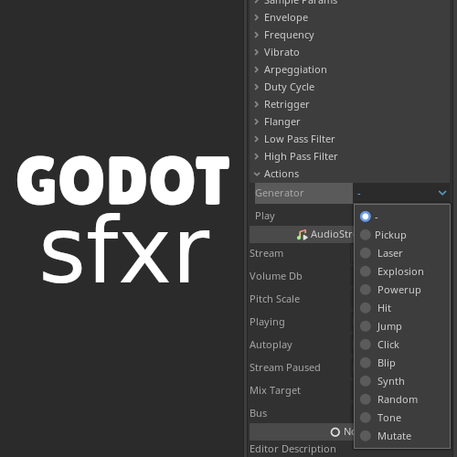

# GodotSfxr

Godot plugin that adds the SfxrStreamPlayer node and SfxrAudioStream Resource to generate sound effects inside the editor.

Ported from [jsfxr](https://sfxr.me/) (by Eric Fredricksen), which is a port from the original [sfxr](https://www.drpetter.se/project_sfxr.html) (by DrPetter).

## Installation

- Install options:

  1. Install from the [Godot Asset Library](https://godotengine.org/asset-library/asset?filter=GodotSfxr&category=5&godot_version=&cost=&sort=updated)*.

  2. Clone or download this repository, and copy the contents of the "addons" directory to the "addons" directory of your Godot Project.

  > \* The download from the Godot Asset Library might not be up to date. You can use Github to always get the latest version.

- After installing the plugin you need to enable it on the menu: ``Project`` > ``Project Settings...`` > ``Plugins`` > ``GodotSfxr``.

## Usage

Add the desired node: ``SfxrStreamPlayer``, ``SfxrStreamPlayer2D``, or ``SfxrStreamPlayer3D``.

Select a preset sound effect under the ``Generators`` group in the inspector.

That will generate and save an ``AudioStreamSample`` resource with the audio data (embedded on the node).

You can adjust the sound parameters on the inspector as needed.

The sound will play automatically after being generated, but you can also click on the ``Playing`` property to make it play.

If for some reason you need to regenerate the sound (maybe you deleted the stream resource), you can use the ``Force Rebuild`` option under the ``Actions`` group.

Everything else works as in the regular ``AudioStreamPlayer*`` nodes.

For example, you can call the ``play`` function on the node, or connect to the ``finished`` signal.

Depending on your needs, you can also create a ``SfxrAudioStream`` Resource that will contain the audio data, and has all the same options as the nodes above.

Then you can use that resource by setting it to the ``stream`` parameter of any ``AudioStreamPlayer``.

