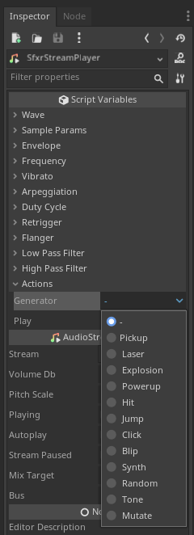

# GodotSfxr

Godot plugin that adds the SfxrStreamPlayer node to generate sound effects inside the editor.

Ported from [jsfxr](https://sfxr.me/) (by Eric Fredricksen), which is a port from the original [sfxr](https://www.drpetter.se/project_sfxr.html) (by DrPetter).

## Installation

- Install from the Godot Asset Library (under review, link pending).

- Clone or download this repository, and copy the contents of the "addons" directory to the "addons" directory of your Godot Project.
