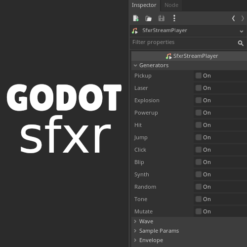

# GodotSfxr

Godot plugin that adds the SfxrStreamPlayer node to generate sound effects inside the editor.

Ported from [jsfxr](https://sfxr.me/) (by Eric Fredricksen), which is a port from the original [sfxr](https://www.drpetter.se/project_sfxr.html) (by DrPetter).

## Installation

- Install from the Godot Asset Library (under review, link pending).

- Clone or download this repository, and copy the contents of the "addons" directory to the "addons" directory of your Godot Project.

## Usage

Add the node "SfxrStreamPlayer".

Select a preset sound effect under the "Actions" group in the inspector.

You can adjust the sound parameters on the inspector as needed.

Click the "Play" checkbox under the "Actions" group to hear the sound effect.

To trigger the sound effect, call the "play_sfx" function on the node.

This custom node is made using the AudioStreamGenerator resource, which is filled with the Audio data to be streamed. The first time the audio data is computed it might take some time (due to gdscript), so it is suggested you "pre-load" it before needing it with the "_build_buffer" function. This will cache the audio data and stream it instantly the next time you play it.

Another drawback is that because it is an AudioStreamGenerator, the player node is always "playing", as it is always waiting for audio data to be streamed, so the "finished" signal is never triggered for this node.
